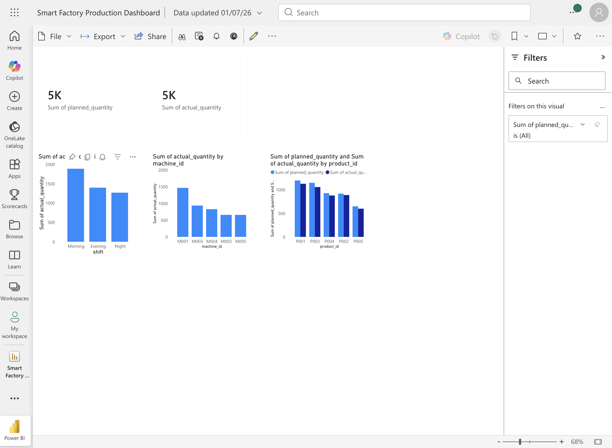

# Smart Factory Analytics

## Project Overview
Smart Factory Analytics is an end-to-end data analytics project that analyzes manufacturing production, machine downtime, and quality inspection data.

The goal of this project is to help factory managers monitor operational performance, identify bottlenecks, reduce downtime, and improve production quality using data-driven insights.

## Business Problem
Manufacturing teams often face issues such as low production efficiency, machine downtime, product defects, and shift-wise performance variation.

This project answers questions like:
- How much production was planned vs actually completed?
- Which machines had the highest downtime?
- What are the main reasons for downtime?
- Which products have the highest defect rate?
- Which shift performed better?
- How can factory managers improve operational efficiency?

## Tools Used
- SQL
- Python
- Power BI
- DAX
- Excel / CSV
- GitHub

## Dataset
This project uses synthetic ERP-style manufacturing data.

Files used:
- `production_orders.csv`
- `downtime_events.csv`
- `quality_inspections.csv`
- `machines.csv`
- `products.csv`

## Key KPIs
- Total Planned Quantity
- Total Actual Quantity
- Production Efficiency %
- Total Downtime Hours
- Defect Rate %
- Pass vs Fail Count
- Shift-wise Performance
- Machine-wise Downtime

## SQL Analysis
SQL queries were written to analyze:
- Planned vs actual production
- Production efficiency
- Downtime by machine
- Downtime reasons
- Defect rate by product
- Shift-wise performance
- Daily production trend

## Dashboard Plan
The Power BI dashboard will include:
- Executive Overview
- Production Analysis
- Downtime Analysis
- Quality Analysis

## Expected Insights
- Identify machines with high downtime
- Find products with high defect rates
- Compare performance across shifts
- Track production efficiency trends
- Support data-driven manufacturing decisions

  ## Dashboard Screenshot

## Project Outcome
This project demonstrates how SQL, Power BI, and analytics can be used to improve manufacturing operations and support business decision-making.
